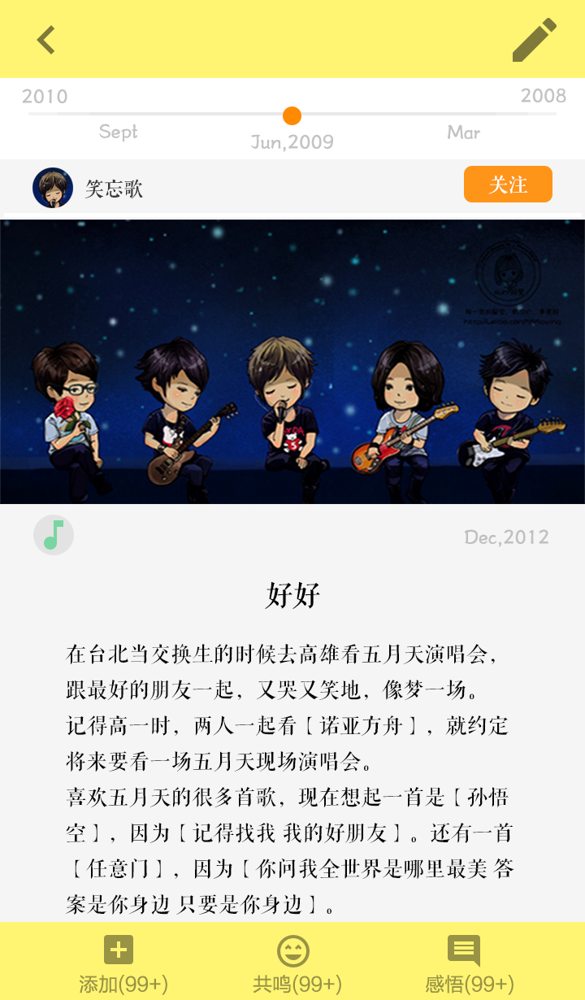
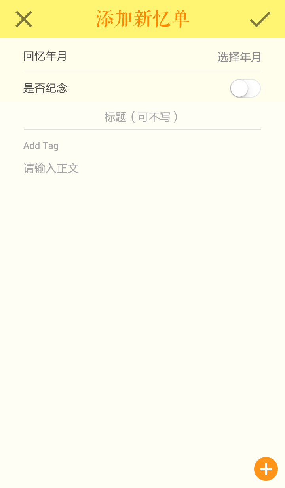

# 7秒

> 你的回忆管家。

## 功能总览
* 登录
* 注册
* 上标题栏
* 广场界面
* 忆单具体界面
* 发现忆单
* 我的

### 登录

#### 输入账号密码
1. 基本的检查账号密码是否匹配
2. 检查账号是否仅包含合法的字符
3. 检查是否输入的是不合法的账号密码

#### 点击登录按钮
* 向服务器传输账号密码并进行匹配
* 在此期间异步显示ProgressDialog 异步显示 避免出现连续点击两次的bug
* 如果登录失败 返回错误信息
* 登录成功进入账号信息的界面 并且记住账号和密码（默认）
* 退出登录以后上次的账号会记录 并默认显示出来

#### 注册按钮跳转到注册界面

#### 登录按钮以后跳转的7秒主界面

### 注册

#### 输入注册的账号和密码
1. 检查输入的注册的账号密码的是否合法
2. 检查输入的账号是否为空
3. 检查输入的账号是否已经在服务器数据库中有了相同的账号

#### 点击注册按钮
* 异步向服务器递交注册信息
* 检验注册信息的合法性 返回错误或者成功信息
* 完成注册后跳转回登录界面
* 如果注册信息有误需要重新填写

#### 点击返回或结束按钮
* 返回登录界面

### 上标题栏
#### 点击添加一条新忆单
* 选择忆单的标题
* 选择回忆的时间
* 选择回忆的标签 确定键完成忆单标签添加
* 添加回忆的内容包括图片的选择添加
* 添加图片按钮从相册选择图片添加
* 点击加号按钮完成忆单添加
* 异步上传服务器忆单添加信息

#### 点击返回按钮回到上一个界面

#### 不同的fragment不同的上标题栏文字
* 相同的添加忆单的按钮
* 不同的上标题栏文字

### 广场忆单

#### 上述显示时间轴
* 是用户选择的时间轴 收藏忆单与该时间点
* 滑动时间轴变化
* 添加忆单的部分

####  初始忆单界面
* 横向显示每一条忆单的 界面样式
* 忆单左拉刷新
  1. 当发生网络链接失败 默认返回错误信息
  2. 当刷新成功会重置广场界面 并重置默认忆单条为5条
* 忆单默认加载五条在广场中
* 忆单右拉加载更多的忆单 继续加载更多的 可能没有 如果有则会继续加载五条

#### 添加收藏按钮
* 点击以后默认添加收藏到上述时间轴中
* 如果改忆单由用户发布 默认无法添加忆单
* 对于忆单 如果用户收藏以后可以在自己时间轴的收藏查看

#### 点击评论
  * 点击评论按钮显示评论
  * 评论右上角红色为未查看的评论

#### 点击赞同
  * 点击一次赞同数目加一
  * 再次点击取消赞
  * 对于忆单判断

#### 点击忆单的其余部分
  * 跳转到该忆单的具体界面

### 忆单具体界面
* 由用户在广场点击跳转

#### 显示标题

#### 显示回忆独特特性

#### 显示标签

#### 显示描述

#### 显示图片

#### 显示评论

#### 显示点赞

#### 收藏按钮

#### 返回按钮 返回广场主界面并且重写刷新

### 发现忆单

#### 按钮进行添加忆单

#### 搜索栏输入内容进行搜索
* 点击以后出现搜索栏的界面
* 出现如同广场以后的搜索界面

#### 分年份搜索和普通搜索

#### 点击分块界面 每一块为一个tag
* 每一块为一个热点tag
* 搜索分为年份搜索普通搜索
* 点击每一个热点标签以后出现热点界面 出现的界面与广场预览忆单界面类似

### 我的
####  我的评论

1. 进入界面可以看到我发布的忆单中的评论（按时间先后排序）
2. 点击用户头像进入用户的主界面
3. 点击内容中的忆单图片可进入对应忆单

#### 编辑资料
1. 可以修改当前用户的资料
2. 可以修改用户的资料和修改用户的年份信息
3. 包括性别名字等方面并检测合法性质
4. 异步更新用户资料

####  我的关注
1. 看到我关注的人
2. 点击用户头像进入用户的主界面
3. 点击星星可取消关注 再次点击星星可添加关注

#### 我的设置
1. 可选退出登录
2. 后序会扩展功能

#### 时间轴
1. 点击对应条目可直接进入忆单
2. 滑动时间轴可以改变时间轴的具体部分

#### 添加忆单
1. 点击右上角的笔可以进入添加忆单界面
2. 具体忆单的添加如上述 添加忆单描述

#### 忆单详情功能
1.  时间轴 : 左右滑动时间轴可改变年份，左边是未来，右边是过去
2. 用户头像：点击用户头像可进入用户主界面
3. 关注按钮：点击可关注该用户
4. 评论功能：点击“留下你的足迹”按钮可开始评论
5. 收藏忆单：点击“+”可添加忆单，收藏的时间点为时间轴最中间的时间
6. 喜欢忆单：点击“笑脸”可为该忆单点赞。

#### 用户主界面
1. 关注状态
  * 右上角的星星表示关注状态
  * 点击可关注或取消关注该用户
2. 时间轴
  * 点击对应条目可直接进入忆单
